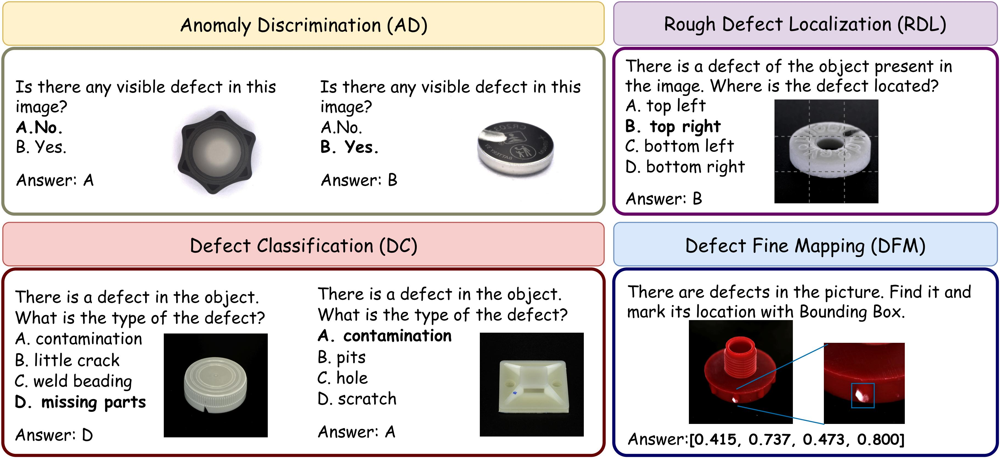

# EIAD: Explainable Industrial Anomaly Detection Via Multi-Modal Large Language Models
<font size=7><div align='center'>
    <a href="https://arxiv.org/pdf/2503.14162"><strong>Paper</strong></a> | 
    <a href="#dataset"><strong>Dataset</strong></a>| 
    <a href="#🛠️training"><strong>Training</strong></a> | 
    <a href="#📜evaluation"><strong>Evaluation</strong></a> 
</div></font>



## 🚀 TL;DR
We contribute to a multi-modal industrial anomaly detection training dataset, named **Defect Detection Question Answering (DDQA)**, encompassing a wide range of defect types and industrial scenarios.  

This dataset spans four diverse tasks: **Anomaly Discrimination, Defect Classification, DefectFine Mapping and Rough Defect Localization**.


## Dataset
#### The four datasets collected by DDQA are as follows. Use the following link to download.

**VISION**: [download VISION](https://huggingface.co/datasets/VISION-Workshop/VISION-Datasets)

**PR-REAL**: [download PR-REAL](https://drive.google.com/file/d/1EBapy9BGnwmZJ9Rxh0uTF-Xii9FU0YCG/view?usp=sharing)

**Real-IAD**: [download Real-IAD](https://huggingface.co/datasets/Real-IAD/Real-IAD)

**BSData**: [download BSData](https://github.com/2Obe/BSData)

**All datasets should be organized into the following format**: (Using the BSData dataset as an example, the same applies to other three datasets)

```
.
└── dataset
    ├── BSData
        ├──BSD
            └──NG
                ├──pitting
                    ├──image
                        ├──...jpg
                    ├──mask
                        ├──...jpg
            └──OK
                ├──image
                    ├──...jpg
```


Each file in the `dataset/` [download link](https://drive.google.com/drive/folders/1eciWmsPx_9AJgRmKcb_HaKFnlJtmOBU0?usp=drive_link)folder corresponds to one specific evaluation task in DDQA, `train.jsonl` contains the complete data of four tasks above, organized into the required training question-and-answer pairs in JSON format:

| File Name                  | Task Name                 | Abbreviation |
|----------------------------|---------------------------|--------------|
| `Task_AD.jsonl`            |  Anomaly Discrimination    |  AD          |
| `Task_DC.jsonl`            |  Defect Classification    |  DC          |
| `Task_DFM.jsonl`           |  DefectFine Mapping        |  DFM         |
| `Task_RDL.jsonl`           |  Rough Defect Localization  |  RDL         |
|────────────────────────────|───────────────────────────|──────────────|
| `train.jsonl`              |          ALL              |  ALL         |


## 🛠️Training
```bash
CUDA_VISIBLE_DEVICES=0 NPROC_PER_NODE=1 swift sft \
  --model_type minicpm-v-v2_6-chat \
  --model_id_or_path OpenBMB/MiniCPM-V-2_6 \
  --sft_type lora \
  --dataset ./dataset/train.jsonl \
  --deepspeed default-zero2
```

```bash
CUDA_VISIBLE_DEVICES=1 swift export \
    --ckpt_dir ./output/minicpm-v-v2_6-chat/ckpt \
    --merge_lora true
```
## 📜Evaluation
Referring to MMAD[https://arxiv.org/pdf/2410.09453], we used the its dataset for evaluation.
Please download the data required for the evaluation first.
```bash
cd eval/dataset
wget -O ALL_DATA.zip https://huggingface.co/datasets/jiang-cc/MMAD/resolve/refs%2Fpr%2F1/ALL_DATA.zip?download=true
unzip ALL_DATA.zip

python eval/evaluation.py --ckpt ./output/minicpm-v-v2_6-chat/ckpt
```
## Citation
If you find our works useful for your research, please consider citing:
```bibtex
@article{zhang2025eiad,
  title={Eiad: Explainable industrial anomaly detection via multi-modal large language models},
  author={Zhang, Zongyun and Ruan, Jiacheng and Gao, Xian and Liu, Ting and Fu, Yuzhuo},
  journal={arXiv preprint arXiv:2503.14162},
  year={2025}
}
```
